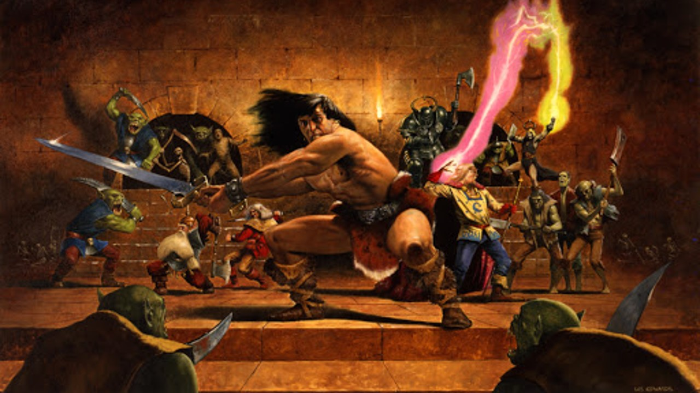

# HeroopQuest

Poging tot HeroQuest als kapstok te gebruiken om eerste OOP concepten in het vak "Object Oriented Programming" van de professionele bachelor elektronica-ict, AP Hogeschool.

# Lokale bronnen
* [Spelregels](utils/speelsysteem-spelregels.pdf)

* Slides
    * [Les 1](slides/les1_heroopquest.pptx)

# Externe bronnen

* [HeroSCribe](http://www.heroscribe.org/download.html): Maps en quest editor
    * [Mappen in XML](http://www.heroscribe.org/xmls.html): Iedere kaart uit het questboek in handig xml formaat

* [HeroQuest in Unity](http://mepem.com/pemcode/?cat=14&paged=5)
* [HeroQuest in Java](https://github.com/jrmcleod/HeroQuest)
* [EpiqQuest](https://bearandhammer.net/2015/05/07/code-project-epic-quest-p2/): C# projectje (enkel begin van spel) met [toffe Unit Testing](https://bearandhammer.net/2015/07/19/epicquest-unit-testing/)

Copyright Tim Dams